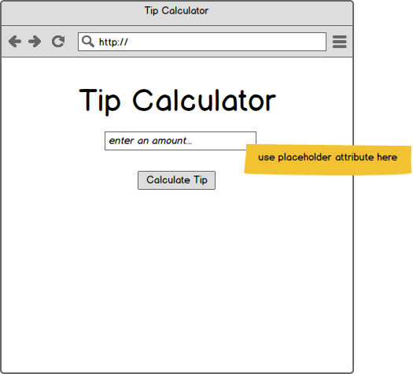
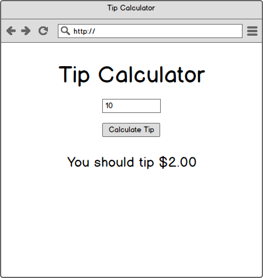
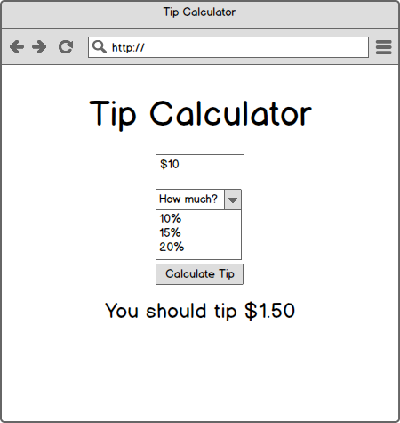

# Tip Calculator

1. Fork, clone and open the project
1. Create a standard HTML project files / folders:
  * index.html
  * css
    * app.css
  * js
    * calculator.js
    * app.js
1. Commit and push / submit a pull request
1. Work through the stories (committing and pushing as you go)
1. Validate your HTML
1. Deploy to S3
1. Add your S3 URL right here:

[ENTER URL HERE]

## Stories

### Minimum Viable Product

**User can see a properly styled form**

    Centered heading
    Centered input field with the correct placeholder
    A button

**User can see the correct tip amount when they enter just a number (no $)**

    When a user enters a number (1, 4, 65 etc...)
    And clicks "Calculate Tip"
    Then they should see the tip amount appear beneath the text field

**User can see the correct tip amount when they enter a number with $**

    When a user enters a dollar amount (like $2, or $300)
    And clicks "Calculate Tip"
    Then they should see the tip amount appear beneath the text field

### Stretch

**User can choose the percent they'd like to tip**

    When a user enters a dollar amount
    And chooses the percent they'd like to tip
    And clicks "Calculate Tip"
    Then they should see the correct tip amount appear beneath the text field

**Users see the tip amount update as they type**

    When a user types, after each keystroke update the tip amount
    HINT: look for the `input` event

    Also change the tip amount automatically when the dropdown is selected
    HINT: look for the change event
